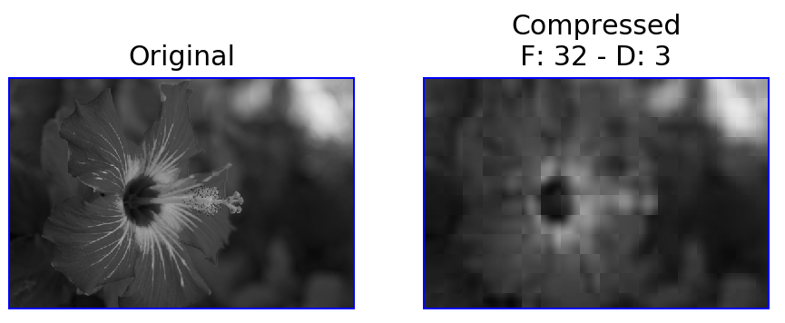
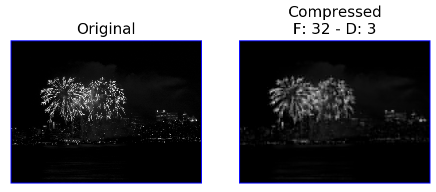
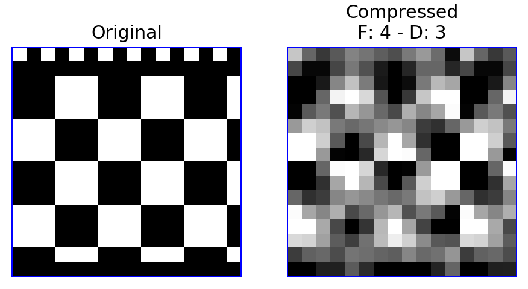

# Direct Cosine Transform & JPEG-like compression

A Python project to implement the Direct Cosine Transform function and to benchmark it against already available libraries that implement the Fast Direct Cosine Transform. The project also implemented a JPEG-like compression (an "easier" version of image-compression part of the JPEG specification).

Made by: Cristian Baldi - Marco Fagioli - Simone Vitali

Developed as one the final projects of the course "Scientific Computing" at Università di Milano Bicocca.

## Setup

* `pip install -r requirements.txt`
* `jupyter notebook`
* Choose `Compress.ipynb` to test image compression
* Choose `Experiments.ipynb` to run the benchmarks

## Images

